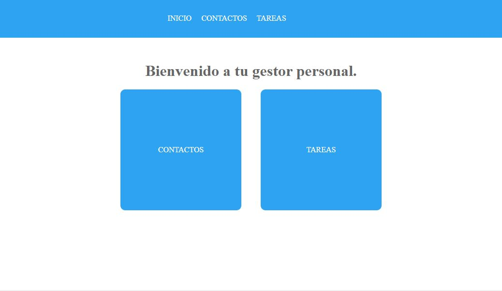
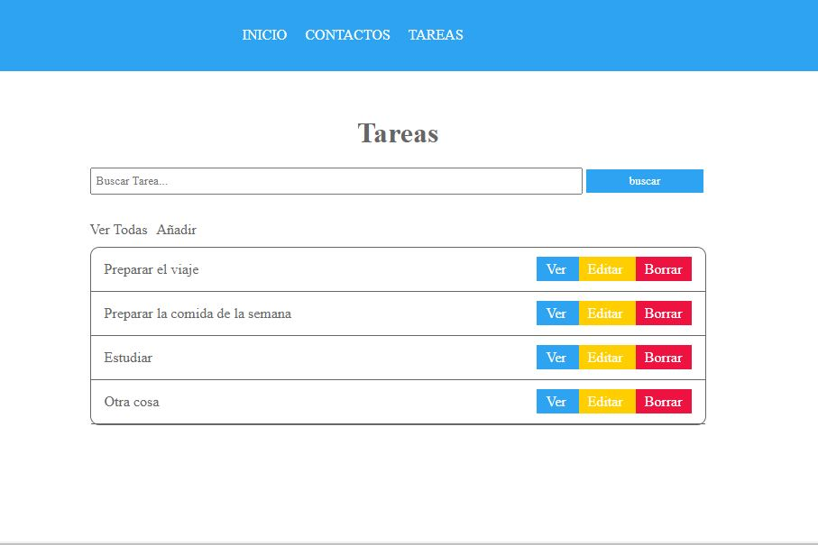
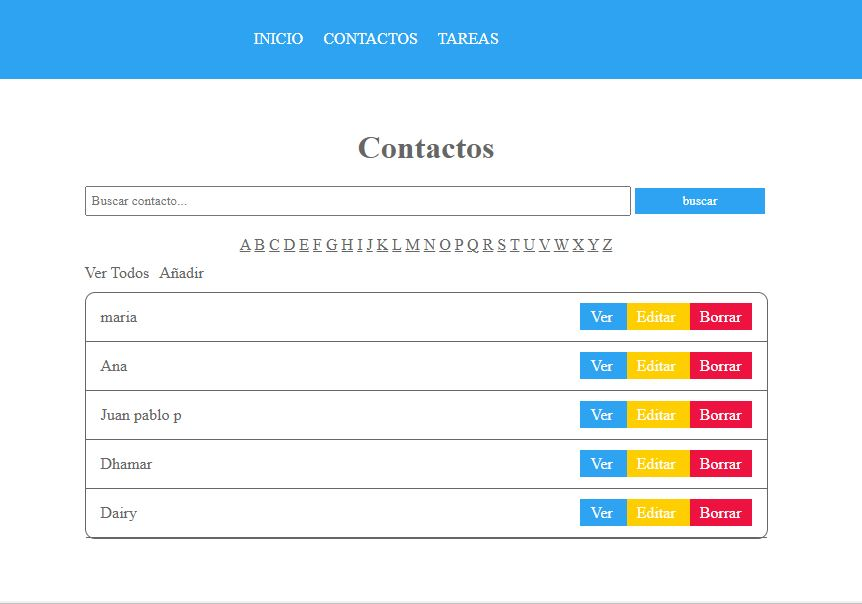

# Task and Contacts List in Django

## Table of contents

- [Overview](#overview)
  - [The challenge](#the-challenge)
  - [Screenshot](#screenshot)
- [My process](#my-process)
  - [Built with](#built-with)
  - [What I learned](#what-i-learned)
- [Author](#author)
- [Acknowledgments](#acknowledgments)

## Overview

### The challenge

"Building a Task and Contacts List Using Django. Practice CRUD.

- Create an interface that allows me to view, add, edit, and delete my contacts.
- Create a second interface that enables me to create, modify, view, and update my tasks."

### Screenshot

## My process

### Built with

- Python 3.10.6
- [Django 4.2.4](https://pypi.org/project/Django/) - Python Framework
- [Python-decouple-3.8](https://pypi.org/project/python-decouple/) - Python library
- [psycopg2-2.9.7](https://pypi.org/project/psycopg2/) - Python library
- [psycopg-3.1.10-py3-none-any.whl](https://pypi.org/project/psycopg/) - Python library
- [PostgreSQL 15.4](https://www.postgresql.org/) - Database

### What I learned

I learned how to create a project in Django, connect a database to the project, and perform the basic operations of creating, reading, updating, and deleting.

## Author

- LinkedIn - [Juan Pablo Cuartas](https://www.your-site.com)
- Email - [juanpa88842@gmail.com](https://www.linkedin.com/in/juanpablocuartas/)

## Acknowledgments

I want to thank Openbootcamp for being the guiding platform in my learning journey of the Django framework.
